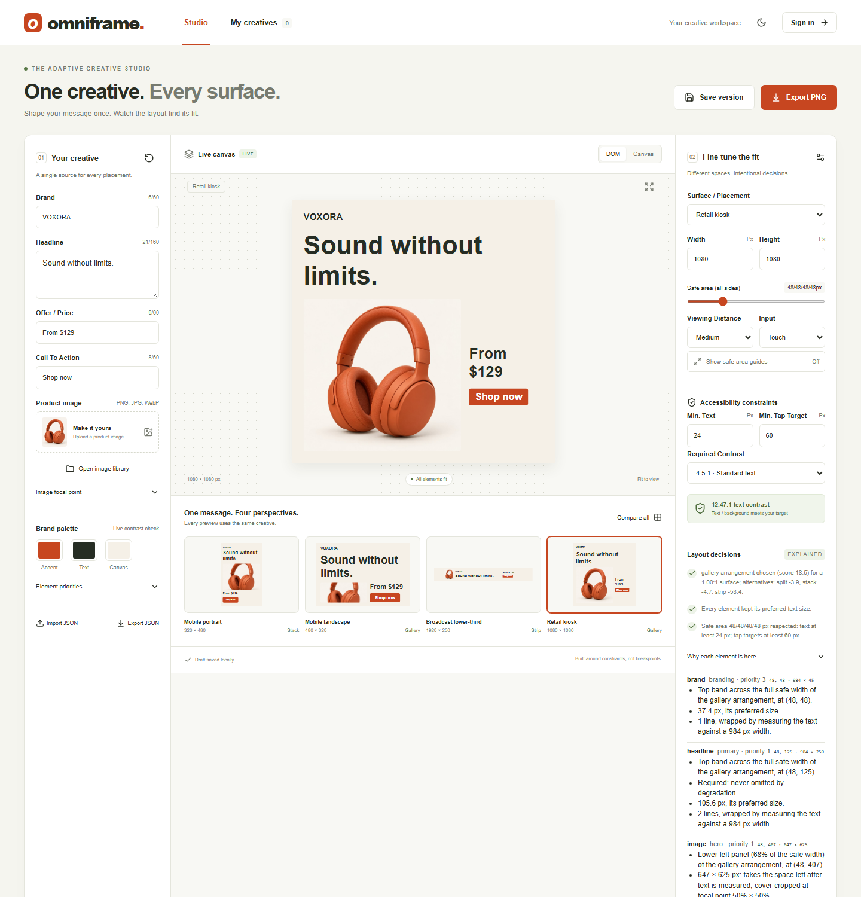
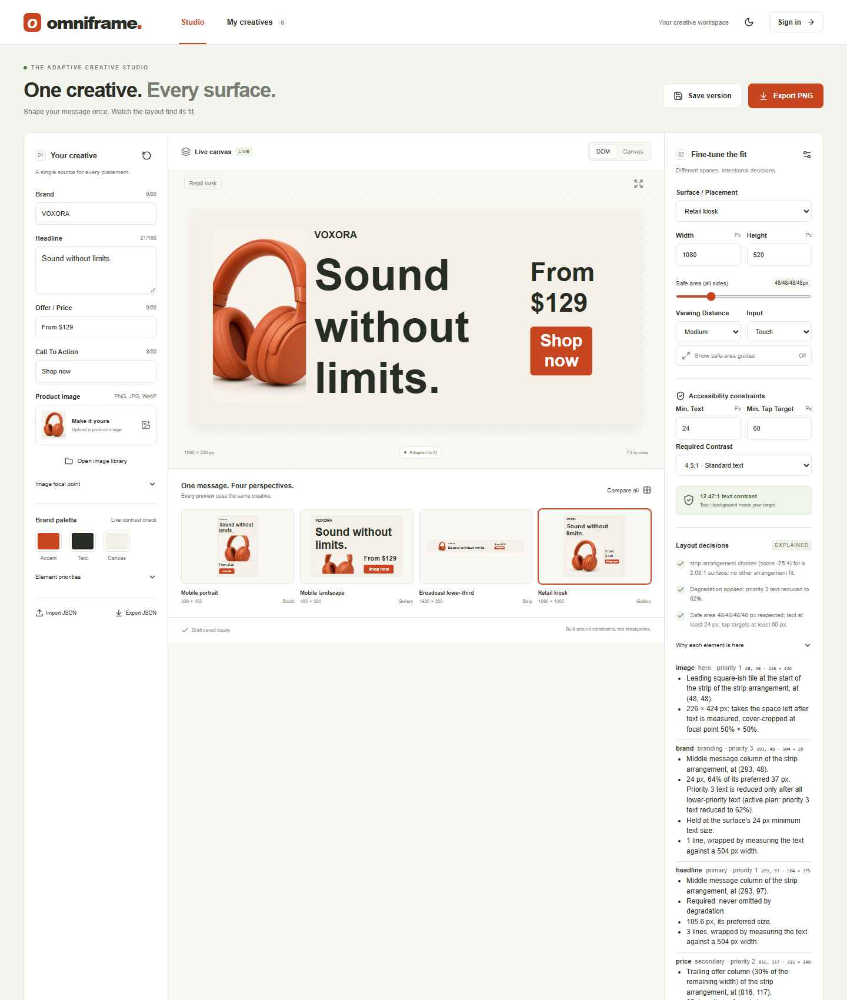
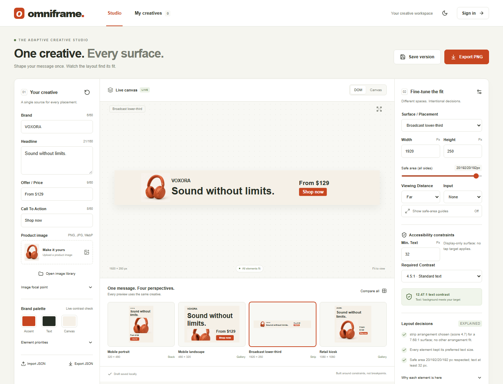

# Omniframe — Adaptive Ad Layout Engine

Submission for FLAM's Frontend R&D assignment *Adaptive Layout Engine for Multi-Surface Ads*. The site opens on the **Layout studio**: one ad spec re-resolved live on the four required surfaces.

## Brief checklist

| Requirement | Where to see it |
| --- | --- |
| One declarative spec (headline, image, price, CTA, branding) | [The spec](#the-spec) · `src/engine/spec.ts` |
| Surface profiles with real constraints (safe area, min text, tap target, viewing distance) | `src/engine/surfaces.ts` · inspector panel |
| Genuine resolver, no per-surface branches | `src/engine/resolver.ts` · [ARCHITECTURE.md](ARCHITECTURE.md#the-algorithm) |
| Surface picker, 4 surfaces, same spec | Studio: the four cards under the preview (compared side by side by default) |
| Meaningfully different arrangements | Each surface card names the arrangement the resolver chose for it |
| Intentionally constrained surface, clean degradation | Inspector → degradation demo (drag the kiosk height), or [`?surface=kiosk&height=520`](https://adaptive-ad-layout-engine.vercel.app/?surface=kiosk&height=520); the *Constrained banner* preset |
| No overlap / clipping | `geometryErrors()` on every candidate; `npm test`, `verify.html` |
| Typed spec, surfaces and output; invalid input rejected | `tests/types.test.ts` (compile-time), `validateSpec` / `validateSurface` (runtime) |
| Spec → resolution → output → rendering separation | `src/engine/*` (no React/DOM, enforced by a test) → `src/render/dom.ts`, `src/render/canvas.ts` |
| Bonus: unseen 5th surface | Surface menu → *Custom surface* |
| Bonus: animated transitions | Switch surfaces (respects reduced motion) |
| Bonus: real text measurement | `src/lib/measure.ts` (Canvas `measureText`) |
| Bonus: Canvas backend, same resolver | Studio toolbar → DOM / Canvas |
| Bonus: accessibility constraints | Tap-target and contrast rules in the resolver and inspector |

The brief's suggested files map to: `spec.ts` → `src/engine/spec.ts`, `surfaces.ts` → `src/engine/surfaces.ts`, `resolver.ts` → `src/engine/resolver.ts`, `render-dom.ts` → `src/render/dom.ts`, `App.tsx` → `src/App.tsx`.

## Extension: ad-platform planner

The **Ad platforms** tab (or `?view=platforms`) is beyond the brief. It applies the same engine to 27 verified placements (Meta, Google, Taboola, LinkedIn plus the four assignment surfaces), with crop checks, copy-length checks and PNG export. Sources: [docs/catalog-verification.md](docs/catalog-verification.md). Results are planning checks, not network approval; TikTok is not buildable until verified. Details: [docs/CREATIVE_FIRST.md](docs/CREATIVE_FIRST.md), [docs/DECISIONS.md](docs/DECISIONS.md).

[Live studio](https://adaptive-ad-layout-engine.vercel.app/) · [Source](https://github.com/deepak-rajpatel/adaptive-ad-layout-engine) · [Architecture](ARCHITECTURE.md) · [Verification](VERIFICATION.md)

One declarative ad spec, resolved by a TypeScript constraint engine into genuinely different layouts for a tall phone, a wide broadcast lower-third, a square retail kiosk, and any other surface you describe. No per-surface templates, no CSS breakpoints deciding geometry, no uniform scaling.



| Kiosk at 520 px: full-size arrangements are exhausted, so only branding (priority 3) is reduced | Broadcast lower-third, 1920 × 250, 32 px minimum text |
| --- | --- |
|  |  |

## Three things to try

1. **Edit the headline.** Every surface preview re-resolves from the same spec.
2. **Run the degradation demo** in the inspector (or open [`?surface=kiosk&height=520`](https://adaptive-ad-layout-engine.vercel.app/?surface=kiosk&height=520)). Drag the kiosk height down. From 1080 to about 540 px the engine only **repositions** everything at full size (gallery → split → strip). At 520 px **branding (priority 3)** shrinks to its 24 px minimum first; then price and CTA (priority 2), then the headline (priority 1). Around 180 px branding and price drop out cleanly while the headline and CTA stay intact; at 140 px the result is reported impossible. **Why each element is here** explains every box.
3. **Describe an unseen surface.** Pick *Custom surface* and set any dimensions, per-surface text minimum, viewing distance, input type, and tap target. The same resolver handles it with no code change. 18 IAB and social sizes are included as further examples.
4. **Plan every placement.** In the planner, set Goal to *Sales* and tick *Goal sets element priorities*. Every composed banner recomposes with the offer promoted, and Sales placements move to the top of each group. Then click *Remove image* to see which placements still work as text only.

## Run locally

Node.js 22.12+ or 24 LTS, npm.

```sh
npm ci
npm run dev        # http://127.0.0.1:5173
npm test           # unit, type-level, persistence, and database-policy tests
npm run build      # strict tsc -b + production build
npm run benchmark  # resolver timing (Vitest bench)
npm run test:e2e   # production build + Playwright planner checks (uses installed Microsoft Edge)
```

With the dev server running, open `http://127.0.0.1:5173/verify.html` to re-run the real-browser layout verification, and `http://127.0.0.1:5173/verify-export.html` to render every planner export and check each PNG's size.

Switch surfaces with the **Surface / placement** menu, the four preview cards, or a URL such as `?surface=broadcast`. The studio works without any Supabase configuration. Scripts call Node entry points directly because Windows command shims break when a parent folder contains `&`.

## The spec

```ts
import { defineAd } from "./src/engine/spec";

export const ad = defineAd({
  elements: [
    { id: "headline", type: "text",   role: "primary",   priority: 1, required: true, content: "Sound without limits." },
    { id: "image",    type: "image",  role: "hero",      priority: 1, content: "/headphones.jpg" },
    { id: "cta",      type: "button", role: "action",    priority: 2, required: true, content: "Shop now" },
    { id: "brand",    type: "text",   role: "branding",  priority: 3, content: "VOXORA" },
    { id: "price",    type: "text",   role: "secondary", priority: 2, truncate: true, content: "From $129" },
  ],
  theme: { background: "#f5f0e7", foreground: "#262d24", accent: "#c74620" },
  focal: { x: 50, y: 50 },
});
```

Priorities follow the brief: **1 is most important**. The editor builds exactly this spec from its form fields (`toSpec` in `src/engine/creativeModel.ts`). The form calls the secondary text "Offer". It keeps the element id `price`, so layouts saved before the rename resolve identically.

## Surfaces

Surfaces are data. The required four use the brief's numbers:

| Surface | Size | Safe area (t/r/b/l) | Min text | Viewing | Input / target | Arrangement |
| --- | --- | --- | --- | --- | --- | --- |
| Mobile portrait (interstitial) | 320 × 480 | 24/16/24/16 | 14 px | near | touch, 44 px | stack |
| Mobile landscape | 480 × 320 | 16/24/16/24 | 14 px | near | touch, 44 px | gallery |
| Broadcast lower-third | 1920 × 250 | 20/192/20/192 (10% title-safe) | 32 px | far | none | strip |
| Retail kiosk | 1080 × 1080 | 48 | 24 px | medium | touch, 60 px | gallery |

Also included: a 240 × 80 constrained banner, 13 IAB display sizes (300×250, 728×90, 160×600, 300×600, 320×50, 320×100, 336×280, 970×250, 970×90, 120×600, 300×1050, 468×60, 300×50), 5 social canvases (1080×1080, 1080×1350, 1080×1920 with story-UI insets, 1200×628, 1200×1200), a Taboola 16:9 concept, and a custom surface. Social and Taboola canvases are composed images: the platform supplies its own UI and tappable CTA, so they declare `input: "none"`.

## Layout algorithm, step by step

`resolve(spec, surface, measure)` in `src/engine/resolver.ts`:

1. **Validate** spec and surface. Invalid input returns `status: "invalid"` with readable reasons.
2. **Check contrast** of text on background and of button text on the accent. Failure returns `impossible`.
3. **Derive base sizes** from the safe box: unit = `max(minTextSize, min(48, 6% of safe width, 16% of safe height))`; each role has a preferred multiple.
4. **Generate candidates** for every *size plan* (below) × four arrangement families (stack, gallery, split, strip) × several width shares. Text is wrapped with real measured widths; the CTA is sized to its label and never below the tap target.
5. **Reject** any candidate with a box outside the safe area, overlapping another, text below the minimum, or a CTA below the target.
6. **Stop at the first feasible stage.** Size plans are tried in degradation order; the first plan with any valid candidate ends the search, so text never shrinks if a layout fits without shrinking. Within that plan, candidates are scored by aspect-ratio fit, priority-weighted text size kept, image area, and a truncation penalty. Ties break by fixed order, so output is deterministic.
7. **If nothing survives, omit** the least important optional element and go back to step 4. If only required elements remain and nothing fits, return `impossible` with a reason.

### Priority and degradation

Degradation is ordered, not improvised:

| Step | What gives way |
| --- | --- |
| Reposition | Every arrangement and width share is tried at each size |
| Shrink | Priority 5 text to 80 % then 62 %, then priority 4, … then priority 1. Nothing at priority *p* shrinks while lower-priority text can still shrink |
| Truncate | Secondary text marked `truncate: true` goes to one measured line with an ellipsis once its own priority level is reduced |
| Drop | Optional elements are omitted highest-number first (later-declared first on ties). Required elements are never dropped |

Text never goes below the surface's `minTextSize`; the CTA never below `minTapTarget`. Each resolved element carries an `explanation` (slot, size, reduction and why, line count and measured width, truncation, target compliance), shown in the inspector. `decisions` records the chosen arrangement with runner-up scores. See [ARCHITECTURE.md](ARCHITECTURE.md) for the scoring formula and cost.

## TypeScript design

- `ElementSpec` is a discriminated union over roles, and each role maps to exactly one type. `{ role: "hero", type: "text" }`, an unknown role, a priority outside 1–5, or `truncate` on a button **do not compile**.
- `Surface` is a union on `input`: touch and pointer surfaces must declare `minTapTarget`; `input: "none"` (broadcast, social images) cannot.
- `defineAd` and `defineSurface` keep literal types and also validate at runtime, throwing `SpecError` / `SurfaceError` for data-level problems: duplicate ids, empty copy, unsafe image URLs, a far viewing distance with text under 24 px, a safe area leaving under 32 px.
- The output `ResolvedLayout` is renderer-ready: absolute boxes, pre-wrapped lines, font sizes, weights, colors, radii. The DOM (`src/render/dom.ts`) and Canvas (`src/render/canvas.ts`) renderers make no decisions.

`tests/types.test.ts` asserts the compile-time errors with `@ts-expect-error`, so the build fails if any becomes legal.

## Resolution flow

```text
AdSpec + Surface + Measure → resolve() → ResolvedLayout → renderDom() | renderCanvas()
```

The engine folder imports nothing from React, the DOM, or the app. Adding a surface is data; adding a renderer only reads `ResolvedLayout`.

## Bonus points

- **Unseen fifth surface:** any custom dimensions and constraints, and 18 extra presets, resolve through the same code path.
- **Transitions:** the artboard fades in on each re-resolve; `prefers-reduced-motion` disables it.
- **Text measurement:** wrapping, hyphenation, and truncation use Canvas `measureText` in the browser. Verified against rendered DOM text in Edge for all 25 presets.
- **Canvas backend:** DOM and Canvas share one `ResolvedLayout`; PNG export uses the Canvas renderer at native size.
- **Accessibility as constraints:** minimum text by viewing distance, tap targets by input type, and WCAG contrast for text and button are first-class, with explicit failure reporting.

## Accounts, library, and cloud (Supabase)

Guest drafts, named versions, favorites, collections, duplicate, rename, delete, and portable JSON import/export work locally without an account. Email sign-up/login, password recovery, a private cloud library, and a private image library use Supabase.

**Current deployment state:** login works, but the database tables and image bucket have **not** been created (verified read-only; see [VERIFICATION.md](VERIFICATION.md)). The app detects this and disables cloud save, the cloud library, and image upload with an explanation.

To enable cloud features:

1. In the Supabase **SQL Editor**, run in order:
   - `supabase/migrations/202609140001_creatives.sql`
   - `supabase/migrations/202609140002_assets.sql`
   - `supabase/migrations/202609140003_asset_delete.sql`
2. **Authentication → URL Configuration:** set Site URL to `https://adaptive-ad-layout-engine.vercel.app`; add it and `http://127.0.0.1:5173` to the redirect URLs.
3. Keep email confirmation on. For real users, configure SMTP; the default sender is rate-limited.
4. Set `VITE_SUPABASE_URL` and `VITE_SUPABASE_PUBLISHABLE_KEY` in `.env.local` and in Vercel. Never put a service-role key in a `VITE_` variable.
5. Create two test accounts, save a cloud version and upload an image with one, and confirm the other cannot see either.

Row-level security limits every creative to `auth.uid() = user_id`; storage policies limit read, upload, and delete to the user's own folder. `tests/database.test.ts` checks these policies against the real SQL in PGlite; that is not a substitute for testing the live project.

## Known limitations

- **One element per role** and a fixed role set (primary, secondary, hero, action, branding). Branding is a text wordmark; a logo image would need its own sizing rule.
- **Landscape and kiosk share the gallery family.** The tall, wide, and square surfaces get three different arrangements (stack, strip, gallery). Mobile landscape fits gallery at full size, and the resolver never shrinks text just to reach a differently shaped layout, so it does not switch to split unless space runs short.
- **Bounded search:** four arrangement families. A general solver could find layouts this one reports as impossible. Score weights are hand-tuned for predictability, not learned.
- **Preferred sizes follow the safe box.** On very shallow surfaces (below about 400 px of safe height) preferred sizes fall with height, so while dragging the kiosk demo the status can return to "ready" at some heights after being "adapted" at taller ones. Every result is still valid and explained.
- No text is placed over the product photo, so contrast-aware placement over images is not needed or modeled. Contrast covers solid text/background and button text only; this is not a full WCAG audit.
- Social safe zones are approximate; confirm each platform's current guidance. IAB and social presets check canvas geometry only, not file weight, animation, or ad-network policy.
- Resolution cost is about 1–2 ms per surface in Node with a stub measurer; the studio resolves five surfaces per edit.
- Browser verification ran on Chromium-based Edge only.
- External HTTPS images may block PNG export through CORS; upload the image instead.
- **Planner:**
  - TikTok formats are listed but not buildable, because its documentation could not be reached to verify specs.
  - Which formats serve which objective is a planning assumption, not a network rule.
  - Google's 150 KB limit for uploaded banners is shown as a note, not checked; two sample banners exceed it.
  - Batch export downloads files one at a time (no zip).
  - Network CTA button lists are not verified, so CTAs are not checked per network.

## Time spent

Recorded timestamps, all 14 September 2026 (IST):

| Time | Event |
| --- | --- |
| 01:07 | Project plan written |
| 01:28 | Repository initialized |
| 03:18 – 05:40 | First implementation session (Codex), committed at 05:40 |
| 11:17 | Image-delivery optimization committed |
| ≈ 11:35 – 12:45 | Review, brief alignment, engine rework, presets, verification, and docs (Claude Code) |
| Afternoon | Creative-first planner, steps 1–9 of `docs/planner-spec.md` (Claude Code); per-step commit times are in `git log` |

That is roughly 11½ hours of calendar time with gaps, including an interruption between about 03:18 and 05:20. Active hands-on time was not tracked with a timer, so **the author should replace this line with their own estimate** before submission.

## AI use

- **Codex** helped with the initial architecture, implementation, tests, and documentation; its built-in image generator created the sample headphone image and the design reference ([design/README.md](design/README.md)).
- **Claude Code** reviewed the implementation against the brief and did the brief-alignment rework: the typed `defineAd` spec and priority semantics, the degradation ladder, the brief's surface constraints, the kiosk demo, separated renderers, per-element explanations, the IAB and social presets, browser verification, and these docs.

- **Claude Code** also implemented the creative-first planner from `docs/planner-spec.md`: removing video, the schema-3 migration, catalog verification against official sources, the planning engine, the planner UI, export, and the Playwright checks. Each step is a separate commit for the author to review.

The author is responsible for reviewing and explaining the work.

## Sources

- [Google Display sizes](https://support.google.com/google-ads/answer/7031480)
- [Taboola image specifications](https://developers.taboola.com/backstage-api/docs/item-thumbnail_url)
- [Supabase React setup](https://supabase.com/docs/guides/getting-started/quickstarts/reactjs)
- [Supabase redirect URLs](https://supabase.com/docs/guides/auth/redirect-urls)
- [Supabase storage access controls](https://supabase.com/docs/guides/storage/security/access-control)
