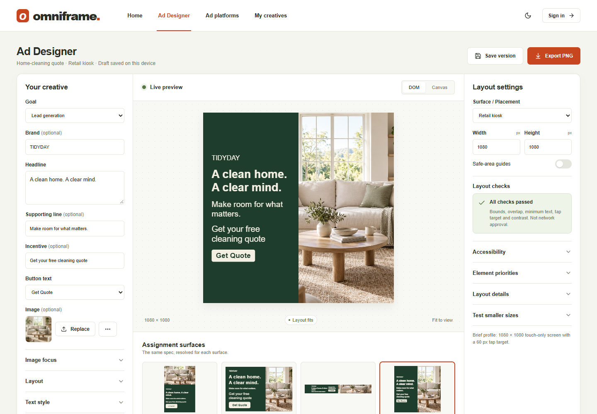
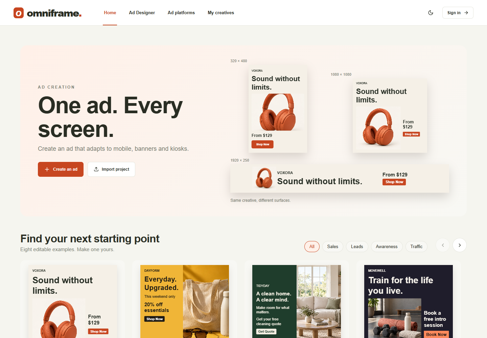
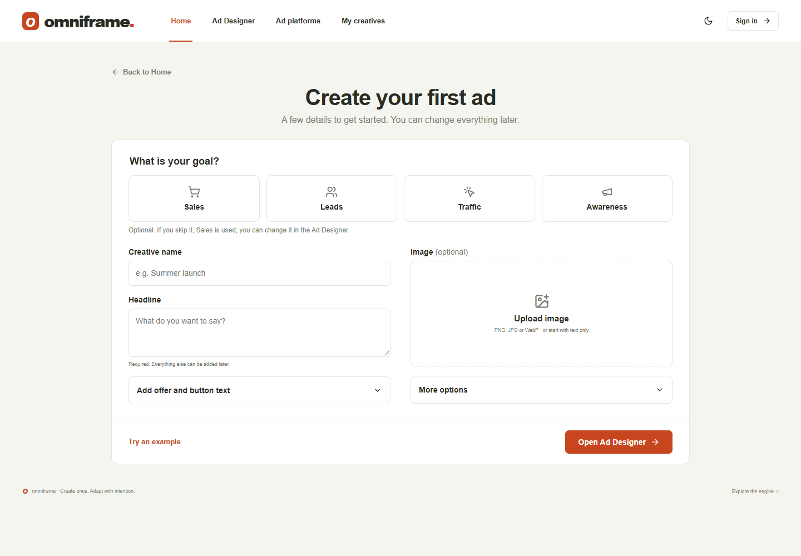
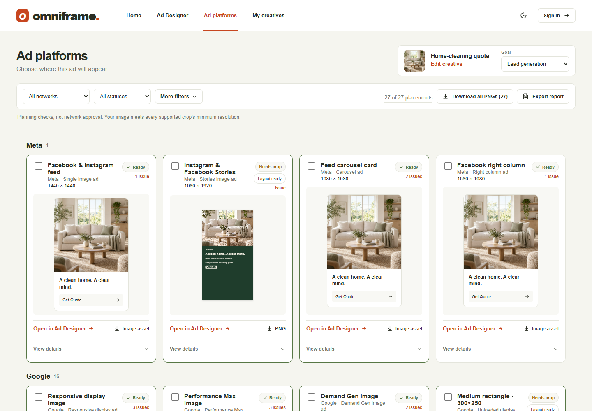
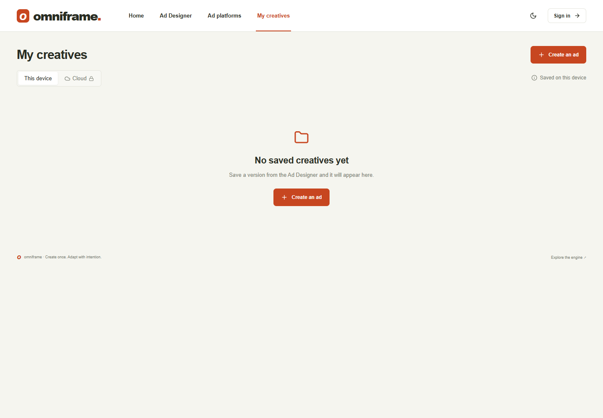

# Omniframe — Adaptive Ad Layout Engine

Submission for FLAM's Frontend R&D assignment *Adaptive Layout Engine for Multi-Surface Ads*. The site opens on **Home**, where you can create an ad, try the example, import a project, or continue a draft. The **Ad Designer** keeps creative inputs on the left, a live DOM/Canvas preview and four assignment surfaces in the centre, and layout settings on the right.

## Brief checklist

| Requirement | Where to see it |
| --- | --- |
| One declarative spec (headline, image, price, CTA, branding) | [The spec](#the-spec) · `src/engine/spec.ts` |
| Surface profiles with real constraints (safe area, min text, tap target, viewing distance) | `src/engine/surfaces.ts` · inspector panel |
| Genuine resolver, no per-surface branches | `src/engine/resolver.ts` · [ARCHITECTURE.md](ARCHITECTURE.md#the-algorithm) |
| Surface picker, 4 surfaces, same spec | Ad Designer → Assignment surfaces beneath the preview |
| Meaningfully different arrangements | Each surface card names the arrangement the resolver chose for it |
| Intentionally constrained surface, clean degradation | Layout settings → Test smaller sizes (drag the kiosk height), or [`?surface=kiosk&height=520`](https://adaptive-ad-layout-engine.vercel.app/?surface=kiosk&height=520); the *Constrained banner* preset |
| No overlap / clipping | `geometryErrors()` on every candidate; `npm test`, `verify.html` |
| Typed spec, surfaces and output; invalid input rejected | `tests/types.test.ts` (compile-time), `validateSpec` / `validateSurface` (runtime) |
| Spec → resolution → output → rendering separation | `src/engine/*` (no React/DOM, enforced by a test) → `src/render/dom.ts`, `src/render/canvas.ts` |
| Bonus: unseen 5th surface | Surface menu → *Custom surface* |
| Bonus: animated transitions | Switch surfaces (respects reduced motion) |
| Bonus: real text measurement | `src/lib/measure.ts` (Canvas `measureText`) |
| Bonus: Canvas backend, same resolver | Ad Designer → Live preview → DOM / Canvas |
| Bonus: accessibility constraints | Tap-target and contrast rules in the resolver and inspector |

The brief's suggested files map to: `spec.ts` → `src/engine/spec.ts`, `surfaces.ts` → `src/engine/surfaces.ts`, `resolver.ts` → `src/engine/resolver.ts`, `render-dom.ts` → `src/render/dom.ts`, `App.tsx` → `src/App.tsx`.

## Extension: ad-platform planner

The **Ad platforms** tab (or `?view=platforms`) is beyond the brief. It applies the same engine to 27 verified placements (Meta, Google, Taboola, LinkedIn plus the four assignment surfaces), with crop checks, copy-length checks and PNG export. Sources: [docs/catalog-verification.md](docs/catalog-verification.md). Results are planning checks, not network approval; TikTok is not buildable until verified. Details: [docs/CREATIVE_FIRST.md](docs/CREATIVE_FIRST.md), [docs/DECISIONS.md](docs/DECISIONS.md).

[Live studio](https://adaptive-ad-layout-engine.vercel.app/) · [Source](https://github.com/deepak-rajpatel/adaptive-ad-layout-engine) · [Architecture](ARCHITECTURE.md) · [Verification](VERIFICATION.md)

One declarative ad spec, resolved by a TypeScript constraint engine into genuinely different layouts for a tall phone, a wide broadcast lower-third, a square retail kiosk, and any other surface you describe. No per-surface templates, no CSS breakpoints deciding geometry, no uniform scaling.

## Current workflow and screenshots

Screenshots captured from the running application on 15 September 2026; these are actual UI captures, not generated mockups. Home shows the first-visit experience; My creatives shows the empty local library. The Ad Designer shows the editable TIDYDAY example. Screenshots show the visible desktop viewport.



| Home: start or resume | Create an ad: short setup |
| --- | --- |
|  |  |

| Ad platforms: placement browsing | My creatives: saved library |
| --- | --- |
|  |  |

1. **Home → Create an ad.** Add a headline, optionally choose a goal, image, brand and offer, then open Ad Designer. Sales is first and is used if setup goal selection is skipped. Existing drafts retain their chosen goal.
2. **Edit and compare.** Change the headline and select the four assignment surfaces. Both DOM and Canvas consume the same resolved layout. Open **Appearance** for colours and button styling, **Text style** for per-element typography, and **Layout** for composition, image prominence, spacing and panel colour. Images support fill or whole-image fitting and focal-point cropping.
3. **Inspect adaptation.** Under Layout settings, expand **Test smaller sizes** and reduce kiosk height. Use **Layout details** to inspect omissions, reductions and element explanations. The outcome depends on the current creative and constraints; required elements are never silently dropped.
4. **Try an unseen surface.** Select **Custom surface**, enter dimensions and expand **Accessibility** to adjust constraints. The resolver needs no surface-specific code change.
5. **Browse Ad platforms.** Filter by Network or Status, expand More filters or a card's View details, and open a placement in Ad Designer. The same creative is retained. Composed PNGs and native image assets are labelled separately.
6. **Save and reopen.** Save version stores a named snapshot in My creatives; automatic draft saving is separate. Home can resume the current draft. Opening different work or importing JSON preserves an unsaved valid draft in the local library before replacement; failure to preserve blocks replacement.
7. **Export.** Export PNG renders at the selected surface's native dimensions. Project options provides JSON import/export. Local use does not require sign-in.

Direct links: [Ad Designer](https://adaptive-ad-layout-engine.vercel.app/?view=designer), [Ad platforms](https://adaptive-ad-layout-engine.vercel.app/?view=platforms), [My creatives](https://adaptive-ad-layout-engine.vercel.app/?view=library), or a required surface such as [`?surface=broadcast`](https://adaptive-ad-layout-engine.vercel.app/?surface=broadcast).

## Run locally

Node.js 22.12+ or 24 LTS, npm.

```sh
npm ci
npm run dev        # http://127.0.0.1:5173
npm test           # unit, type-level, persistence, and database-policy tests
npm run build      # strict tsc -b + production build
npm run benchmark  # resolver timing (Vitest bench)
npm run test:e2e   # production build + Playwright designer, planner and workflow checks (uses installed Microsoft Edge)
```

With the dev server running, open `http://127.0.0.1:5173/verify.html` to re-run the real-browser layout verification, and `http://127.0.0.1:5173/verify-export.html` to render every planner export and check each PNG's size.

Switch surfaces with the **Surface / placement** menu, the four preview cards, or a URL such as `?surface=broadcast`. The studio works without any Supabase configuration. Scripts call Node entry points directly because Windows command shims break when a parent folder contains `&`.

## The spec

```ts
import { defineAd } from "./src/engine/spec";

export const ad = defineAd({
  elements: [
    { id: "headline", type: "text",   role: "primary",   priority: 1, required: true, content: "Sound without limits." },
    { id: "image",    type: "image",  role: "hero",      priority: 1, content: "/headphones.jpg" },
    { id: "cta",      type: "button", role: "action",    priority: 2, required: true, content: "Shop now" },
    { id: "brand",    type: "text",   role: "branding",  priority: 3, content: "VOXORA" },
    { id: "price",    type: "text",   role: "secondary", priority: 2, truncate: true, content: "From $129" },
  ],
  theme: { background: "#f5f0e7", foreground: "#262d24", accent: "#c74620" },
  focal: { x: 50, y: 50 },
});
```

Priorities follow the brief: **1 is most important**. The editor builds exactly this spec from its form fields (`toSpec` in `src/engine/creativeModel.ts`). The form calls the secondary text "Offer". It keeps the element id `price`, so layouts saved before the rename resolve identically.

## Surfaces

Surfaces are data. The demo includes the four required surface categories, using the brief's example dimensions and interaction constraints where supplied; safe-area insets and other unspecified values are project choices:

| Surface | Size | Safe area (t/r/b/l) | Min text | Viewing | Input / target | Arrangement |
| --- | --- | --- | --- | --- | --- | --- |
| Mobile portrait (interstitial) | 320 × 480 | 24/16/24/16 | 14 px | near | touch, 44 px | stack |
| Mobile landscape | 480 × 320 | 16/24/16/24 | 14 px | near | touch, 44 px | gallery |
| Broadcast lower-third | 1920 × 250 | 20/192/20/192 (10% title-safe) | 32 px | far | none | strip |
| Retail kiosk | 1080 × 1080 | 48 | 24 px | medium | touch, 60 px | gallery |

Also included: a 240 × 80 constrained banner, 13 IAB display sizes (300×250, 728×90, 160×600, 300×600, 320×50, 320×100, 336×280, 970×250, 970×90, 120×600, 300×1050, 468×60, 300×50), 5 social canvases (1080×1080, 1080×1350, 1080×1920 with story-UI insets, 1200×628, 1200×1200), a Taboola 16:9 concept, and a custom surface. Social and Taboola canvases are composed images: the platform supplies its own UI and tappable CTA, so they declare `input: "none"`.

## Layout algorithm, step by step

`resolve(spec, surface, measure)` in `src/engine/resolver.ts`:

1. **Validate** spec and surface. Invalid input returns `status: "invalid"` with readable reasons.
2. **Check contrast** of text on background and of button text on the accent. Failure returns `impossible`.
3. **Derive base sizes** from the safe box: unit = `max(minTextSize, min(48, 6% of safe width, 16% of safe height))`; each role has a preferred multiple.
4. **Generate candidates.** Automatic mode tries each size plan across stack, gallery, split and strip arrangements and several width shares. An optional product, panel or typographic composition is searched first, with automatic arrangements as fallback. These families reflow by aspect ratio, not surface identity. Text uses real measured widths and the selected font; the CTA never falls below the tap target.
5. **Reject** any candidate with invalid content geometry, text below the minimum, or a CTA below the target. Background imagery and panels may reach the canvas edges. Content overlapping background imagery must be entirely backed by a solid panel, with text contrast checked against that panel.
6. **Choose deterministically.** Within each search, stop at the first feasible size plan and score its candidates. Automatic mode therefore never shrinks text when an automatic arrangement fits at preferred size. An explicit composition preference is searched before automatic fallback and can retain that composition with smaller text. Scores consider retained text size, image area and truncation; composition scores also penalize broken words and deviation from the requested image share.
7. **If nothing survives, omit** the least important optional element and go back to step 4. If only required elements remain and nothing fits, return `impossible` with a reason.

### Priority and degradation

Degradation is ordered, not improvised:

| Step | What gives way |
| --- | --- |
| Reposition | Every arrangement and width share is tried at each size |
| Shrink | Priority 5 text to 80 % then 62 %, then priority 4, … then priority 1. Nothing at priority *p* shrinks while lower-priority text can still shrink |
| Truncate | Secondary text marked `truncate: true` goes to one measured line with an ellipsis once its own priority level is reduced |
| Drop | Optional elements are omitted highest-number first (later-declared first on ties). Required elements are never dropped |

Text never goes below the surface's `minTextSize`; the CTA never below `minTapTarget`. Each resolved element carries an `explanation` (slot, size, reduction and why, line count and measured width, truncation, target compliance), shown in the inspector. `decisions` records the chosen arrangement with runner-up scores. See [ARCHITECTURE.md](ARCHITECTURE.md) for the scoring formula and cost.

### Editable creative examples

Home includes eight fictional campaigns, with real resolver previews. DAYFORM uses a product-led composition, TIDYDAY a photo and solid copy panel, and OPEN SHELF a typographic composition with a separate book illustration. Brand, headline, supporting line, offer, CTA, image and decoration remain independent elements. The three font choices are installed system stacks; each text element can set weight, preferred size, alignment and colour. See [examples and asset provenance](docs/examples.md).

The original five roles remain supported; supporting text and decorative imagery extend the model to seven roles, with one element per role. Optional decoration uses priority 5 in the examples. Preferred-family candidates retain decoration only at preferred text sizes; normal priority-based omission and automatic fallback still apply. Old drafts receive defaults for new fields, and the v2 golden-fixture test checks identical legacy layouts.

## TypeScript design

- `ElementSpec` is a discriminated union over roles, and each role maps to exactly one type. `{ role: "hero", type: "text" }`, an unknown role, a priority outside 1–5, or `truncate` on a button **do not compile**.
- `Surface` is a union on `input`: touch and pointer surfaces must declare `minTapTarget`; `input: "none"` (broadcast, social images) cannot.
- `defineAd` and `defineSurface` keep literal types and also validate at runtime, throwing `SpecError` / `SurfaceError` for data-level problems: duplicate ids, empty copy, unsafe image URLs, a far viewing distance with text under 24 px, a safe area leaving under 32 px.
- The output `ResolvedLayout` is renderer-ready: absolute boxes, pre-wrapped lines, font sizes, weights, colors, radii. The DOM (`src/render/dom.ts`) and Canvas (`src/render/canvas.ts`) renderers make no decisions.

`tests/types.test.ts` asserts the compile-time errors with `@ts-expect-error`, so the build fails if any becomes legal.

## Resolution flow

```text
AdSpec + Surface + Measure → resolve() → ResolvedLayout → renderDom() | renderCanvas()
```

The engine folder imports nothing from React, the DOM, or the app. Adding a surface is data; adding a renderer only reads `ResolvedLayout`.

## Bonus points

- **Unseen fifth surface:** any custom dimensions and constraints, and 18 extra presets, resolve through the same code path.
- **Transitions:** the artboard fades in on each re-resolve; `prefers-reduced-motion` disables it.
- **Text measurement:** wrapping, hyphenation, and truncation use Canvas `measureText` in the browser. Verified against rendered DOM text in Edge for all 25 presets.
- **Canvas backend:** DOM and Canvas share one `ResolvedLayout`; PNG export uses the Canvas renderer at native size.
- **Accessibility as constraints:** minimum text by viewing distance, tap targets by input type, and WCAG contrast for text and button are first-class, with explicit failure reporting.

## Accounts, library, and cloud (Supabase)

Guest drafts, named versions, favorites, collections, duplicate, rename, delete, and portable JSON import/export work locally without an account. Email sign-up/login, password recovery, a private cloud library, and a private image library use Supabase.

**Last recorded cloud check (14 September 2026):** login worked, but the database tables and image bucket had **not** been created (see [VERIFICATION.md](VERIFICATION.md)); this documentation refresh did not recheck the live backend. The app detects this and disables cloud save, the cloud library, and image upload with an explanation.

To enable cloud features:

1. In the Supabase **SQL Editor**, run in order:
   - `supabase/migrations/202609140001_creatives.sql`
   - `supabase/migrations/202609140002_assets.sql`
   - `supabase/migrations/202609140003_asset_delete.sql`
2. **Authentication → URL Configuration:** set Site URL to `https://adaptive-ad-layout-engine.vercel.app`; add it and `http://127.0.0.1:5173` to the redirect URLs.
3. Keep email confirmation on. For real users, configure SMTP; the default sender is rate-limited.
4. Set `VITE_SUPABASE_URL` and `VITE_SUPABASE_PUBLISHABLE_KEY` in `.env.local` and in Vercel. Never put a service-role key in a `VITE_` variable.
5. Create two test accounts, save a cloud version and upload an image with one, and confirm the other cannot see either.

Row-level security limits every creative to `auth.uid() = user_id`; storage policies limit read, upload, and delete to the user's own folder. `tests/database.test.ts` checks these policies against the real SQL in PGlite; that is not a substitute for testing the live project.

## Known limitations

- Unfinished Create-page inputs and pending image processing survive in-app navigation, but not a full reload. Once created, the current creative uses local draft autosaving.
- Drafts and local versions depend on browser storage; export JSON for a portable backup. Cloud features require the optional Supabase setup and are not required for the assignment demo.

- **One element per role:** primary, secondary, hero, action, branding, supporting and decoration. Branding is a text wordmark; independent image logos, badges, masks and arbitrary graphic layers are not implemented.
- **Automatic sample arrangements:** landscape and kiosk share gallery; portrait uses stack and broadcast uses strip. The three optional composition families offer additional visual directions and aspect-ratio reflow.
- **Bounded search:** four automatic arrangements and three optional composition families. A general solver could find layouts this one reports as impossible. Score weights are hand-tuned, not learned. Composition preference may select reduced text before trying automatic fallback.
- **Preferred sizes follow the safe box.** On very shallow surfaces (below about 400 px of safe height) preferred sizes fall with height, so while dragging the kiosk demo the status can return to "ready" at some heights after being "adapted" at taller ones. Every result is still valid and explained.
- No text is placed over the product photo, so contrast-aware placement over images is not needed or modeled. Contrast covers solid text/background and button text only; this is not a full WCAG audit.
- Social safe zones are approximate; confirm each platform's current guidance. IAB and social presets check canvas geometry only, not file weight, animation, or ad-network policy.
- Earlier automatic-mode benchmarks measured about 1–2 ms per surface with a stub measurer; these are not measurements of the new composition families or browser rendering.
- Browser verification ran on Chromium-based Edge only.
- External HTTPS images may block PNG export through CORS; upload the image instead.
- **Planner:**
  - TikTok formats are listed but not buildable, because its documentation could not be reached to verify specs.
  - Which formats serve which objective is a planning assumption, not a network rule.
  - Google's 150 KB limit for uploaded banners is shown as a note, not checked; two sample banners exceed it.
  - Batch export downloads files one at a time (no zip).
  - Network CTA button lists are not verified, so CTAs are not checked per network.

## Time spent

Development, review and revisions took place on **14–15 September 2026**, across multiple sessions. Active working hours were not tracked, so no precise hour total is claimed. The commit history records implementation milestones; it is not a measure of uninterrupted work time.

## AI use

AI assistance is disclosed as required by the assignment:

- **Codex:** initial architecture and implementation assistance, code review, documentation, generated design references, the fictional headphone asset and six example photographs (see [design/README.md](design/README.md) and [asset prompts](docs/generated-example-assets.md)). It also reviewed the connected workflow and prepared submission documentation and screenshots.
- **Claude Code:** engine/brief alignment, placement planner, Ad Designer controls, connected Home/Create/My creatives workflow, persistence and upload fixes, editable composition families, typography, the book SVG illustration, and automated checks.
- **Author:** selected the design direction, reviewed the UI, requested revisions and is responsible for the submitted implementation and explaining its behaviour.

The repository retains AI co-author credits. The assignment permits AI tools with disclosure and expects the author to explain the final code, demonstrate degradation and add an unseen surface during interview.

## Sources

- [Google Display sizes](https://support.google.com/google-ads/answer/7031480)
- [Taboola image specifications](https://developers.taboola.com/backstage-api/docs/item-thumbnail_url)
- [Supabase React setup](https://supabase.com/docs/guides/getting-started/quickstarts/reactjs)
- [Supabase redirect URLs](https://supabase.com/docs/guides/auth/redirect-urls)
- [Supabase storage access controls](https://supabase.com/docs/guides/storage/security/access-control)
